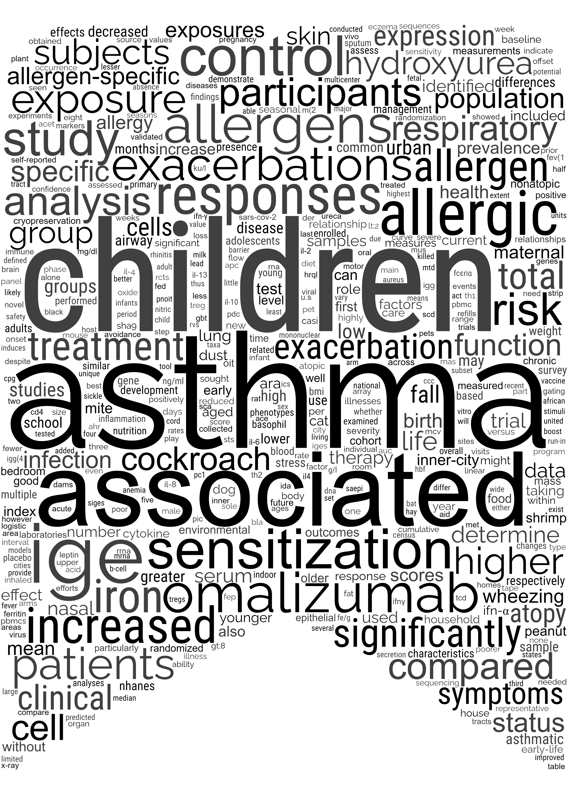

```{r, echo=FALSE}
library(fontawesome)
```

```{css, echo = FALSE}
* {
/* Override default margins*/
--pagedjs-margin-right: 0.1in;
--pagedjs-margin-left: 0in;
--pagedjs-margin-top: 0.1in;
--pagedjs-margin-bottom: 0.1in;
}

# .sidebox { margin-left: 1px; }

:root{
--sidebar-horizontal-padding: 0.01in; /* Reduce sidebar padding */
--sidebar-margin-left: 0.01in;
--sidebar-width: 11rem; /* side bar width */
--sidebar-background-color: #e2d3cd;
--decorator-border: 3px solid #e2d3cd; /* change color and thickness of timeline */
}

.decorator::after{
background-color: #e2d3cd; /* change color timeline dots */
}

/* Define the font family here */
body{
font-family: "Roboto", sans-serif;
}

.aside {
width: calc(var(--sidebar-width) + 9px);
line-height: 1.0;
font-size: 0.80rem;
padding: 0px;
}

.aside .level2 {
  margin-top: 0.3in;
}

a {
color: brown
}
```

Aside
================================================================================

{width=85%}

**Contact Info** {#contact}
--------------------------------------------------------------------------------

- <i class="fa fa-envelope"></i> &nbsp; acalatroni@gmail.com
- <i class="fa fa-github"></i>   &nbsp; [agstn](https://github.com/agstn)
- <i class="fa fa-twitter"></i>  &nbsp; [@acalatr](https://twitter.com/acalatr)
- <i class="fa fa-linkedin"></i> &nbsp; [Agustin Calatroni](https://www.linkedin.com/in/agustin-calatroni-41280b132/)
- <i class="fa fa-phone"></i>    &nbsp; (858) 754-8842
- <i class="fa fa-building"></i> &nbsp; La Jolla, California

&nbsp;&nbsp;&nbsp;&nbsp;&nbsp;&nbsp; {width=50%}

<small>**Statistical Skills**</small> {#stat_skills}
--------------------------------------------------------------------------------
|                        |
|------------------------|
| Linear (Mixed) Models  |
| Additive (Mixed) Models|
| Prediction Models      |
| Latent Class Models    |
| Visualization          |
| Study/Patients Dashboards|
| Clinical Trial Design  |

<small>**Software**</small> {#software_skills}
--------------------------------------------------------------------------------
|                        |
|------------------------|
| R & RStudio            |
| SAS                    |
| H2O.ai (ML)            |
| HTML/CSS               |

<small>**Statistical Societies**</small> {#prof_soc}
--------------------------------------------------------------------------------
|                        |
|------------------------|
| [American Statistical Association](https://www.amstat.org/)                 |
| [Statisticians in the Pharmaceutical Industry (PSI)](https://psiweb.org/)         |


<small>**Therapeutic Areas**</small> {#therapeutic_skills}
--------------------------------------------------------------------------------
|                        |
|------------------------|
| Asthma                 |
| Atopic Disease         |
| Food Allergy           |
| Hematology             |
| Immunology             |
| Microbiome             |

Main
================================================================================

Agustin Calatroni {#title}
--------------------------------------------------------------------------------

**Senior Director, Biostatistics Strategy** in NIAID-funded Statistical Coordinating Center at Rho since 2005, as such I design, implement, analyze, and report on multicenter randomized, observational, and mechanistic clinical trials related to asthma, allergy, and immunology. Furthermore, I provide internal and industry sponsors statistical consulting on complex and novel statistical methodologies.

**Currently seeking a position that will allow me to use my statistical and programming expertise to deliver cutting edge analyses and visualizations to research professionals.**

Professional Experience {data-icon=suitcase}
--------------------------------------------------------------------------------

### Senior Director, Biostatistics Strategy

Rho, Inc 

Durham, NC <br>&nbsp;&nbsp;&nbsp; San Diego, CA

Present - 2005

- 2017 - Principal Statistical Scientist I
- 2011 - Statistical Scientist 
- 2005 - Senior Statistician

Serves as the lead study statistician for multiple federally funded studies including complex, multi-center, multi-stage study designs. Advises external study team and educates internal statistical team on advanced statistical topics. Collaborates on large study teams with federal sponsor, pharmaceutical partners, and independent academic centers. Mentors statisticians throughout the company


### Statistican

Center for Human Growth and Development <br> Univerity of Michigan 

Ann Arbor, MI

2005 - 2002

Served as statistician on a six universities multi-species research project on the brain and behavior in early iron deficiency

### Computer Support Specialist

SMT (SportsMEDIA Technology)

Durham, NC

2002 - 1996

Produced graphics, statistics and video enhancement software for live television sports broadcast networks <br>
<i class="fa fa-award"></i> 2000 EMMY winner _ESPN Seedworld NASCAR coverage_


Education {data-icon=graduation-cap}
--------------------------------------------------------------------------------

### North Carolina State University

Master of Science in Statistics

Raleigh, NC 

2002 - 2000

<i class="fa fa-medal"></i> Mu Sigma Rho Honors Society


### Université Paris I - Panthéon-Sorbonne

Masters en Sciences Économiques

Paris, FR 

1996 - 1995

<i class="fa fa-medal"></i> Summa cum laude


### Erasmus School of Economics

Summer School in Econometrics and Statistics

Rotterdam, NL 

1995


### Université d'Aix-Marseille III 

Maîtrise en Sciences Économiques

Aix-en-Provence, FR 

1995 - 1991

<i class="fa fa-medal"></i> Summa cum laude

### Lycée Franco-Argentin Jean Mermoz

Baccalauréat en Sciences Économiques

Buenos Aires, AR 

1991 - 1988

Extracurricular Activities  {data-icon=leanpub}
--------------------------------------------------------------------------------

### [Wonderful Wednesday (WW) Challenge](https://www.psiweb.org/sigs-special-interest-groups/visualisation/welcome-to-wonderful-wednesdays)

Statisticians in the Pharmaceutical Industry (PSI) Visualization Special Interest Group (VIS SIG)

N/A 

2022 - 2020

<i class="fa fa-github"></i>    &nbsp;  <a href="https://github.com/agstn/WW">Visualizations and Dashboards Contributions </a> <br>
<i class="fa fa-youtube"></i>   &nbsp; [Visualization of multiple endpoints over times](https://www.psiweb.org/vod/item/psi-vissig-wonderful-wednesday-16-multiple-endpoints-in-vasculitis#video_567535951) <br>
<i class="fa fa-microphone"></i> &nbsp;&nbsp; [Interviewed for the Effective Statistician podcast](https://theeffectivestatistician.com/)

::: {.aside}
<i class="far fa-chart-bar"></i> Our industry is data-driven. Every phase of clinical studies requires collecting, monitoring, analyzing, and reporting data. While each of these steps is equally important, reporting is arguably the most impactful step. Indeed, in the reporting phase, key decision-makers will interpret and conclude. As part of the Center for Applied Data Visualization, I have been researching and promoting the best practices and tools for visualizing and reporting data. As such, I have developed dozens of novel graphics for both static reports and interactive web-based use.[Examples of data visualization and statistical graphics](http://graphics.rhoworld.com/) 
:::

### <i class="fas fa-award"></i> [RStudio Table Contest- Honorable Mention](https://www.rstudio.com/blog/winners-of-the-2021-table-contest/)

<!-- [Describer: An Interactive Table Interface for Data Summaries](https://github.com/agstn/describer) -->

<i class="fa fa-github"></i> <a href="https://github.com/agstn/describer">Describer: An Interactive Table Interface for Data Summaries </a>

N/A

2021

### <i class="fas fa-award"></i> [RStudio Table Contest- Honorable Mention](https://www.rstudio.com/blog/winners-of-the-2020-rstudio-table-contest/)

<!-- [The Big Mac Index Table](https://github.com/agstn/RStudio_table_contest_2020) -->

<i class="fa fa-github"></i> <a href="https://github.com/agstn/RStudio_table_contest_2020">The Big Mac Index Tables </a>

N/A

2020

### [Industry Mentor](https://www.samsi.info/imsm-history-and-past-workshops/)

The Statistical and Applied Mathematical Sciences Institute (SAMSI) Industrial Math/Stat Modeling Workshop (IMSM)

N/A

2020 - 2011

Objective is to expose graduate students in mathematics, engineering, and statistics to challenging and exciting real-world problems arising in industrial and government laboratory research.  
<i class="fa fa-comment"></i> &nbsp; [Rho Participates in Graduate Student Workshop for the 8th Consecutive Time](https://www.rhoworld.com/rho-participates-in-innovative-graduate-student-workshop-for-the-8th-consecutive-tim)  	
<i class="fa fa-youtube"></i> &nbsp; [2019 Continuous glucose monitors (CGMs) w/ Functional Data Analysis](https://www.youtube.com/watch?v=qpYHtXH82Ws&ab_channel=SAMSIInstitute)

### [AstraZeneca-Sanger Drug Combination Prediction DREAM Challenge](https://www.synapse.org/#!Synapse:syn4231880/wiki/235645)	

Advancing Cancer Treatment with Artificial Intelligence

N/A

2015	

Open innovation competition hosted by Sage Bionetworks using crowdsourcing to identify new solutions to pressing pharmaceutical research and development challenges 
<i class="fas fa-award"></i>  Rho Innovation Award		


Selected Presentations {data-icon=chalkboard-teacher}
--------------------------------------------------------------------------------

### [Interactive dashboards without Shiny](https://agstn.github.io/UseR2022_dashboards/UseR2022_dashboards.html#/title-slide)	

UseR conference <a href="https://github.com/agstn/UseR2022_dashboards"> <i class="fa fa-github fa-lg"></i></a>

Virtual

2022


### [Visualization of The Museum of Modern Art (MoMA) Collection](https://agstn.github.io/moma_trelliscopejs/app/)	

Scalable, flexible, interactive approach to visualizing data <a href="https://github.com/agstn/moma_trelliscopejs"> <i class="fa fa-github fa-lg"></i></a>

Blog 

2018


### [AAAAI NHLBI & NIAID Invited Course Faculty](https://aaaai.confex.com/aaaai/2017/webprogram/Session7669.html)	

Clinical Trial Designs to Predict Asthma Exacerbations	

Atlanta, GA	

2017	

### [Model Ensembles Using Cross Validation](https://github.com/agstn/useR16_ensemble/blob/master/Poster/Poster_useR2016.pdf)

UseR conference <a href="https://github.com/agstn/useR16_ensemble"> <i class="fa fa-github fa-lg"></i></a>

Palo Alto, CA

2016


### [AAAAI/NIEHS Invited Course Faculty](https://aaaai.confex.com/aaaai/2014/webprogram/Session2703.html)	

NHANES: Getting to Grips with the Big Data	

San Diego, CA	

2014

### <i class="fab fa-youtube"></i> [Rho Wide Corporate Training](https://www.youtube.com/watch?v=a9RTHU-0qTY&t=7s&ab_channel=RhoInc1984)	

Visualizing Multivariate Data &#8634; Information Into Understanding

Chapel Hill, NC

2013

<i class="fa fa-award"></i>  Rho Presidential Award for _Outstanding Innovation for statistical visualization_

### [Correlation with Left Censored and Repeated Measures Data](https://rhoinc.github.io/publication-library/pubs/JSM2008_Calatroni.pdf)	

Joint Statistical Meetings	

Denver, CO	

2008


Selected Publications [<sub><small>**Full List**</small></sub>](https://pubmed.ncbi.nlm.nih.gov/?term=agustin+Calatroni%5BAuthor%5D&show_snippets=off&sort=date&size=200){data-icon=book}
--------------------------------------------------------------------------------

### [Mepolizumab for Urban Children with Exacerbation-Prone Eosinophilic Asthma: A Randomised Controlled Trial](https://clinicaltrials.gov/ct2/show/NCT03292588)  

The Lancet [in press]

N/A

2022

### [Risk factors for SARS-CoV-2 infection and transmission in households w/ children w/ asthma and allergy: A prospective surveillance study](https://pubmed.ncbi.nlm.nih.gov/35660376/)

Journal of Allergy and Clinical Immunology  	

N/A  

2022

### [Development of a human skin commensal microbe for bacteriotherapy of atopic dermatitis and use in a phase 1 randomized clinical trial](https://pubmed.ncbi.nlm.nih.gov/33619370/)

Nature Medicine		

N/A  

2021  

### [Distinct nasal airway bacterial microbiotas differentially relate to exacerbation in pediatric patients with asthma](https://pubmed.ncbi.nlm.nih.gov/31201890)	

Journal of Allergy and Clinical Immunology  	

N/A  

2019	  

### [The nonlesional skin surface distinguishes atopic dermatitis with food allergy as a unique endotype](https://pubmed.ncbi.nlm.nih.gov/30787169)	

Science Translational Medicine  		

N/A  	

2019  	

### [Longitudinal Phenotypes of Respiratory Health in a High-Risk Urban Birth Cohort](https://pubmed.ncbi.nlm.nih.gov/30079758)	

American Journal of Respiratory and Critical Care Medicine  		

N/A  	

2019  	

### [Early decrease in basophil sensitivity to Ara h 2 precedes sustained unresponsiveness after peanut oral immunotherapy](https://pubmed.ncbi.nlm.nih.gov/31377342)	

Journal of Allergy and Clinical Immunology  		

N/A  	

2019  

<i class="fab fa-youtube"></i> [The Application of Data Driven Approaches to Flow Cytometric](https://www.youtube.com/watch?v=I4g2PoINxkY&ab_channel=BuhlmannDiagnostics)

### [The association of allergic sensitization patterns in early childhood with disease manifestations and immunological reactivity at 10 years](https://pubmed.ncbi.nlm.nih.gov/31046157)  

Clinical & Experimental Allergy	  	

N/A  	

2019  	

### [A computerized decision support tool to implement asthma guidelines for children and adolescents](https://pubmed.ncbi.nlm.nih.gov/30529451)	

The Journal of Allergy and Clinical Immunology: In Practice  		

N/A  	

2019  

<i class="fab fa-github"></i>  <a href="https://rhoinc.github.io/asthma-control-graphic/"> Interactive figure lets users explore the data </a>  

### [Early-life home environment and risk of asthma among inner-city children](https://pubmed.ncbi.nlm.nih.gov/28939248)  	

Journal of Allergy and Clinical Immunology  		

N/A  	

2018  	


### [Effects of Omalizumab on Rhinovirus Infections, Illnesses, and Exacerbations of Asthma](https://pubmed.ncbi.nlm.nih.gov/28608756)	

American Journal of Respiratory and Critical Care Medicine	  	

N/A	  

2017	  

### [Graphic depiction of bioinformatics data](https://pubmed.ncbi.nlm.nih.gov/28647586)

Journal of Allergy and Clinical Immunology  	

N/A	  

2017	  

<i class="fab fa-github"></i>  <a href="https://github.com/RhoInc/jaci-bioinformaticsgraphics">Source code, data and results for all figures</a>

### [Can we predict fall asthma exacerbations? Validation of the seasonal asthma exacerbation index](https://pubmed.ncbi.nlm.nih.gov/28238748)	

Journal of Allergy and Clinical Immunology  		

N/A	  

2017	  

### [Minimally important differences and risk levels for the Composite Asthma Severity Index](https://pubmed.ncbi.nlm.nih.gov/27744028)	

Journal of Allergy and Clinical Immunology  		

N/A	  

2017	  

<i class="fab fa-github"></i>  <a href="https://github.com/RhoInc/CASI_MID"> Simulation material for the Composite Asthma Severity Index (CASI) </a>

### [Preseasonal treatment with either omalizumab or an inhaled corticosteroid boost to prevent fall asthma exacerbations](https://pubmed.ncbi.nlm.nih.gov/26518090)	

Journal of Allergy and Clinical Immunology  		

N/A	  

2015	  


### [Randomized trial of omalizumab (anti-IgE) for asthma in inner-city children](https://pubmed.ncbi.nlm.nih.gov/21410369)	

New England Journal of Medicine  

N/A  

2011

<i class="fab fa-github"></i>  <a href="https://github.com/RhoInc/GAMMapp">GAMMapp : a Shiny app for exploring longitudinal and seasonal data</a>

{.aside}
================================================================================

<br>
<br>
<i class="fas fa-edit"></i> 
Together as a team of investigators, we are motivated by discovery and results to improve health, extend life, and enhance the quality of life. We achieve this by helping our industry, federal, and academic clients run clinical and epidemiological studies, while also guiding them through complex and novel statistical methodology in manuscript writing and presentations. 
<br>

As the Senior Director of Biostatistics Strategy for the following Statistical and Clinical Coordinating Centers:  

|                        |
|------------------------|
| [Inner-City Asthma Consortium (ICAC)](https://www.niaid.nih.gov/clinical-trials/inner-city-asthma-consortium) |  
| [Childhood Asthma Clinical Research Network (CAUSE)](https://www.nih.gov/news-events/news-releases/nih-establishes-new-childhood-asthma-clinical-research-network) |   
| [Atopic Dermatitis Research Network (ADRN)](https://www.niaid.nih.gov/research/atopic-dermatitis-research-network)  | 
| [Immune Tolerance Network (ITN)](https://www.niaid.nih.gov/research/immune-tolerance-network)  |
| [Human Epidemiology and Response to SARS-CoV-2 (HEROS)](https://www.niaid.nih.gov/news-events/study-determine-incidence-novel-coronavirus-infection-us-children-begins) |  

I provide statistical expertise and scientific leadership in developing clinical trials to investigate asthma, allergen immunotherapy, and environmental exposure interventions and their roles in allergy and asthma using both translational research methodologies as well as the analysis of omics data.

{width=100%}

